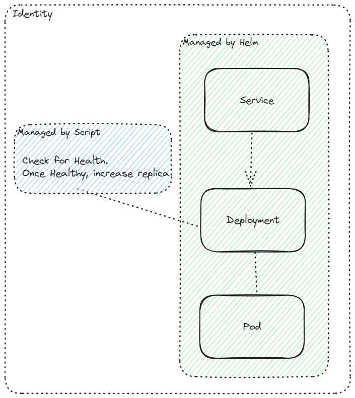

## High Availability Solutions with Camunda 8
### Overview
This document outlines the high availability possibilities with Camunda, highlighting which components can be scaled and any limitations that apply. Additionally, it includes examples and code snippets to help guide the implementation.

## Session Configurations

Due to the scaling of WebApps, it might be required to configure sticky sessions on the load-balancer. Otherwise, as Webapps will create sessions with clients, unauthorized errors may occur.

This is an example of configuring sticky sessions on the loadbalancer utilizing Nginx:

```
global:
  license:
    existingSecret: "camunda-license"
    existingSecretKey: "key"
  multitenancy:
    enabled: true
  ingress:
    enabled: true
    className: nginx
    host: "normunda.de"
    tls:
      enabled: true
      secretName: "tls-secret"
    annotations:
      cert-manager.io/cluster-issuer: "letsencrypt-prod"
      ingress.kubernetes.io/rewrite-target: "/"
      nginx.ingress.kubernetes.io/ssl-redirect: "false"
      # Testing because of redirect errors
      # Can be refined, and maybe declare dedicated Operate ingress?
      nginx.ingress.kubernetes.io/affinity: "cookie"
      nginx.ingress.kubernetes.io/session-cookie-name: "route"
      nginx.ingress.kubernetes.io/session-cookie-hash: "sha1"
```
## Camunda Components and Scaling
For smooth execution, set the following environment parameters:

    # Specify to Helm Release Name
    export release=camunda

    # Specify to Namespace of Camunda Deployment
    export namespace=camunda

    export identityReplicas=3

    export replicas=2
### Keycloak
Keycloak can be scaled out-of-the-box and within the helm chart:

    identityKeycloak:
        enabled: true
        replicaCount: 3
    
### Identity


Identity can only be scaled after the Realm creation of Keycloak has been successfully completed.
Thus, it has to be guaranteed that Keycloak is up and running.

Idea: Scale Identity once healthy by pinging the health endpoint

    kubectl port-forward svc/camunda-identity 8082:8082 -n $namespace
    http://localhost:8082/actuator/health

Afterward, simply scale the deployment by executing:

    kubectl scale deployment camunda-identity --replicas=$identityReplicas -n $namespace

#### Extension:
Affinities can be set on the helm charts directly. If affinity is wanted, see this part of the values.yaml:

```
identity:
  contextPath: "/identity"
  fullURL: "https://normunda.de/identity"
  externalDatabase:
    enabled: true
    database: camunda
    host: my-postgresql.camunda.svc.cluster.local
    port: 5432
    username: camunda
    password: camunda
  resources:
    limits: null
    requests:
      cpu: 1
      memory: 1Gi
  affinity:
    podAntiAffinity:
      requiredDuringSchedulingIgnoredDuringExecution:
        - labelSelector:
            matchExpressions:
              - key: app.kubernetes.io/component
                operator: In
                values:
                  - identity
          topologyKey: "kubernetes.io/hostname"  # Ensure this is correctly indented and formatted
```

### Operate
Operate has limited scalability support, because the importer and archiver of Operate cannot be scaled independently.
Hint: Importers can be scaled per partition, but with only one importer per partition maximum.

The WebApps, as well as the REST API, can be scaled by setting:
- CAMUNDA_OPERATE_IMPORTERENABLED=FALSE
- CAMUNDA_OPERATE_ARCHIVERENABLED=FALSE

Here is one way of scaling Operate:

1. Retrieve the deployment description:

```
kubectl get deployment $release-operate -n $namespace -o yaml > operate_template.yaml
```

2. Clean-Up deployment:

```
yq eval 'del(.status, .metadata, .spec.template.metadata.annotations, .spec.template.metadata.creationTimestamp,  .spec.selector)' -i operate_template.yaml
```
3. Scale Replicas of WebApp

```
yq eval '.metadata.name = "operate-webapp" |
.spec.selector.matchLabels.webapp = "operate-webapp" |
.spec.template.metadata.labels.webapp = "operate-webapp" |
.spec.replicas = env(replicas)' -i operate_template.yaml
```

4. Disable Archiver and Importer

```
yq eval '.spec.template.spec.containers[0].env += [{"name": "CAMUNDA_OPERATE_IMPORTERENABLED", "value": "FALSE"}, {"name": "CAMUNDA_OPERATE_ARCHIVERENABLED", "value": "FALSE"}]' operate_template.yaml -i
```

5. Apply to Cluster

```
kubectl apply -f operate_template.yaml -n $namespace
```

#### Extension:
If podAntiAffinity should be specified, here is an example to run before applying the configuration:
```
yq eval '.spec.template.spec.affinity.podAntiAffinity.requiredDuringSchedulingIgnoredDuringExecution[0].labelSelector.matchExpressions[0].key = "app.kubernetes.io/component" |
.spec.template.spec.affinity.podAntiAffinity.requiredDuringSchedulingIgnoredDuringExecution[0].labelSelector.matchExpressions[0].operator = "In" |
.spec.template.spec.affinity.podAntiAffinity.requiredDuringSchedulingIgnoredDuringExecution[0].labelSelector.matchExpressions[0].values = ["tasklist"] |
.spec.template.spec.affinity.podAntiAffinity.requiredDuringSchedulingIgnoredDuringExecution[0].topologyKey = "kubernetes.io/hostname"' -i tasklist_template.yaml
```

### Tasklist
Tasklist is following the same principles and procedures as Operate.

1. Retrieve the deployment description:

```
kubectl get deployment $release-tasklist -n $namespace -o yaml > tasklist_template.yaml
```

2. Clean-Up deployment:

```
yq eval 'del(.status, .metadata, .spec.template.metadata.annotations, .spec.template.metadata.creationTimestamp,  .spec.selector)' -i tasklist_template.yaml
```

3. Scale Replicas of WebApp

```
yq eval '.metadata.name = "tasklist-webapp" | .spec.selector.matchLabels.webapp = "tasklist-webapp" | .spec.template.metadata.labels.webapp = "tasklist-webapp" | .spec.replicas = env(replicas)' -i tasklist_template.yaml
```
4. Disable Archiver and Importer

```
yq eval '.spec.template.spec.containers[0].env += [{"name": "CAMUNDA_TASKLIST_IMPORTERENABLED", "value": "FALSE"}, {"name": "CAMUNDA_TASKLIST_ARCHIVERENABLED", "value": "FALSE"}]' tasklist_template.yaml -i
```
5. Apply to Cluster

```
kubectl apply -f tasklist_template.yaml -n $namespace
```
#### Extension:

If podAntiAffinity should be specified, here is an example to run before applying the configuration:
```
yq eval '.spec.template.spec.affinity.podAntiAffinity.requiredDuringSchedulingIgnoredDuringExecution[0].labelSelector.matchExpressions[0].key = "app.kubernetes.io/component" |
.spec.template.spec.affinity.podAntiAffinity.requiredDuringSchedulingIgnoredDuringExecution[0].labelSelector.matchExpressions[0].operator = "In" |
.spec.template.spec.affinity.podAntiAffinity.requiredDuringSchedulingIgnoredDuringExecution[0].labelSelector.matchExpressions[0].values = ["tasklist"] |
.spec.template.spec.affinity.podAntiAffinity.requiredDuringSchedulingIgnoredDuringExecution[0].topologyKey = "kubernetes.io/hostname"' -i tasklist_template.yaml
```
### Optimize
Similar to Operate and Tasklist, Optimize cannot be scaled on the importer level.

1. Retrieve ConfigMap of Optimize

```
kubectl get configmap camunda-optimize-configuration -o yaml > camunda-optimize-configuration.yaml
```

3. Change values of configmap
```
yq '.metadata.name = "optimize-webapps-config" | (.data."environment-config.yaml" | from_yaml | (.zeebe.enabled = false) | to_yaml) as $updated_env | .data."environment-config.yaml" = $updated_env' camunda-optimize-configuration.yaml > optimize-configuration_template.yaml
```
3. Apply ConfigMap

```
k apply -f optimize-configuration_template.yaml -n $namespace
```
4. Retrieve the deployment description:

```
kubectl get deployment $release-optimize -n $namespace -o yaml > optimize_template.yaml
```

5. Clean-Up deployment:

```
yq eval 'del(.status, .metadata, .spec.template.metadata.annotations, .spec.template.metadata.creationTimestamp,  .spec.selector)' -i optimize_template.yaml
```
6. Scale Replicas of WebApp

```
yq eval '.metadata.name = "optimize-webapp" | .spec.selector.matchLabels.webapp = "optimize-webapp" | .spec.template.metadata.labels.webapp = "optimize-webapp" | .spec.replicas = env(replicas)' -i optimize_template.yaml
```
7. Disable Importer

```
yq eval '
(.spec.template.spec.volumes[] | select(.configMap.name == "camunda-optimize-configuration").configMap.name) = "optimize-webapps-config"
' -i optimize_template.yaml

yq eval 'del(.spec.template.spec.containers[0].env[] | select(.name == "CAMUNDA_OPTIMIZE_ZEEBE_ENABLED"))' -i optimize_template.yaml
yq eval '.spec.template.spec.containers[0].env += [{"name": "CAMUNDA_OPTIMIZE_ZEEBE_ENABLED", "value": "false"}]' -i optimize_template.yaml
```
8. Disable InitContainers

```
yq eval 'del(.spec.template.spec.initContainers)' -i optimize_template.yaml
```
9. Disable History Clean-Up

```
yq eval 'del(.spec.template.spec.containers[0].env[] | select(.name == "CAMUNDA_OPTIMIZE_HISTORY_CLEANUP_PROCESS_DATA_CLEANUP_ENABLED"))' -i optimize_template.yaml
yq eval 'del(.spec.template.spec.containers[0].env[] | select(.name == "CAMUNDA_OPTIMIZE_HISTORY_CLEANUP_DECISION_DATA_CLEANUP_ENABLED"))' -i optimize_template.yaml
yq eval 'del(.spec.template.spec.containers[0].env[] | select(.name == "CAMUNDA_OPTIMIZE_HISTORY_CLEANUP_INGESTED_EVENT_CLEANUP_ENABLED"))' -i optimize_template.yaml

yq eval '.spec.template.spec.containers[0].env += [{"name": "CAMUNDA_OPTIMIZE_HISTORY_CLEANUP_PROCESS_DATA_CLEANUP_ENABLED", "value": "false"}, {"name": "CAMUNDA_OPTIMIZE_HISTORY_CLEANUP_DECISION_DATA_CLEANUP_ENABLED", "value": "false"}, {"name": "CAMUNDA_OPTIMIZE_HISTORY_CLEANUP_INGESTED_EVENT_CLEANUP_ENABLED", "value": "false"}]' -i optimize_template.yaml
```
10. Apply to Cluster

```
kubectl apply -f optimize_template.yaml -n $namespace
```
#### Extension:
If podAntiAffinity should be specified, here is an example to run before applying the configuration:
```
yq eval '.spec.template.spec.affinity.podAntiAffinity.requiredDuringSchedulingIgnoredDuringExecution[0].labelSelector.matchExpressions[0].key = "app.kubernetes.io/component" |
.spec.template.spec.affinity.podAntiAffinity.requiredDuringSchedulingIgnoredDuringExecution[0].labelSelector.matchExpressions[0].operator = "In" |
.spec.template.spec.affinity.podAntiAffinity.requiredDuringSchedulingIgnoredDuringExecution[0].labelSelector.matchExpressions[0].values = ["optimize"] |
.spec.template.spec.affinity.podAntiAffinity.requiredDuringSchedulingIgnoredDuringExecution[0].topologyKey = "kubernetes.io/hostname"' -i optimize_template.yaml
```
## Web Modeler
In theory: Web-Modeler WebApps and REST API are scalable.
```
kubectl scale deployment camunda-web-modeler-restapi --replicas=$replicas
kubectl scale deployment camunda-web-modeler-webapp --replicas=$replicas
```
Web Modeler websockets cannot be scaled as of now
## Clean-Up

Delete regular helm deployment of camunda by running:
```
helm uninstall $release -n $(camunda)
```
Optionally also delete PVCs: 
```
k delete pvc --all -n $(camunda)
```
Delete newly created deployments:
```
k delete deployments optimize-webapp
k delete deployments operate-webapp
k delete deployments tasklist-webapp
k delete configmap optimize-webapps-config
```